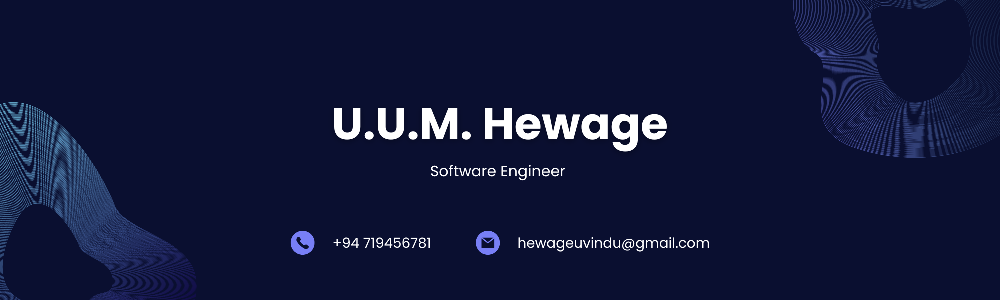

# 

  

  

  

  
  

# 
Hi there! 👋 I'm Uvindu Hewage

  

---

## 🚀 **About Me**
- 🔭 Currently crafting a **Hotel Management System**
- 🌱 Exploring **Firebase, Laravel & AWS**
- 👨‍💻 Check out my work at **[My Portfolio](https://uvinduhewage.github.io/MY-PORTFOLIO/)**
- 💬 Let's talk **React, MERN Stack & Full-Stack Development**
- 📫 Reach me: **hewageuvindu@gmail.com**
- 📝 Writing on **[Medium](https://medium.com/@hewageuvindu)**

### ⚡ **Fun Fact**
*Once debugged a complex animation issue for hours only to discover it was rendering upside-down because I set Y-axis rotation to 180° instead of X-axis! 🙃*

---

## 
🌐 **Connect With Me**

  
  
  
  
  
  

---

## 
🛠️ **Languages and Tools**

---

## 
📊 **GitHub Analytics**

  
  

  

---

## 
🏆 **Achievements**

  

---

## 📈 Contribution Graph

  <!-- Add more impressive contribution graph -->
  

## ☑️ Support:

  

  

