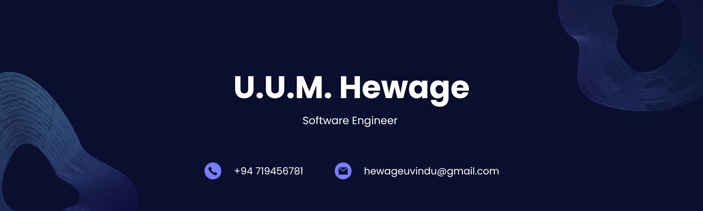

<!-- FUTURISTIC GITHUB PROFILE README -->

<div align="center">


</div>

<div align="center">


</div>

<div align="center">


</div>

<br />

<h1 align="center">👋 Hi, I'm Uvindu Hewage</h1>

<h3 align="center">Associate Software Engineer | Full-Stack Developer | MERN Stack Enthusiast</h3>

<p align="center">
  I build modern, scalable, and user-friendly web applications with clean interfaces, practical workflows, and future-ready architecture.
</p>

<br />

<div align="center">



</div>

---

## 🧬 Identity Core

<div align="center">

<table>
  <tr>
    <td><strong>👨‍💻 Role</strong></td>
    <td>Associate Software Engineer</td>
  </tr>
  <tr>
    <td><strong>🏢 Company</strong></td>
    <td>Hayleys Fentons Limited</td>
  </tr>
  <tr>
    <td><strong>💻 Department</strong></td>
    <td>FIT - Fentons Information Technology</td>
  </tr>
  <tr>
    <td><strong>🚀 Current Project</strong></td>
    <td>CPM System - Construction Project Management Platform</td>
  </tr>
  <tr>
    <td><strong>⚙️ Main Stack</strong></td>
    <td>MongoDB, Express.js, React, Node.js</td>
  </tr>
  <tr>
    <td><strong>🌱 Exploring</strong></td>
    <td>Next.js, Express.js, AWS, System Design</td>
  </tr>
  <tr>
    <td><strong>🎯 Interests</strong></td>
    <td>Web Apps, Dashboards, SaaS Platforms, 3D Web Experiences</td>
  </tr>
  <tr>
    <td><strong>🧠 Mindset</strong></td>
    <td>Learn. Build. Improve. Repeat.</td>
  </tr>
</table>

</div>

---

## 🛰️ Current Mission: CPM System

I’m currently working as an **Associate Software Engineer** at **Hayleys Fentons Limited**, under **FIT - Fentons Information Technology**.

As part of my current role, I’m contributing to the development of a **CPM System - Construction Project Management Platform** designed to support construction-related project workflows, task management, team coordination, and operational visibility.

### Company Context

- 🏢 **Company:** Hayleys Fentons Limited
- 💻 **Department:** FIT - Fentons Information Technology
- 👨‍💻 **Role:** Associate Software Engineer
- 🏗️ **Project:** CPM System - Construction Project Management Platform

### Core Focus Areas

- 🏗️ Construction project management
- ✅ Task and subtask tracking
- 👥 Team collaboration
- 📊 Dashboard-based workflow
- 📱 Responsive web app experience
- 🔐 Authentication and user management
- 🚀 Scalable internal business platform

> Goal: Build a clean, efficient, and scalable platform that helps improve construction project workflows and digital operations.

---

## 🚀 About Me

I’m **Uvindu Hewage**, an **Associate Software Engineer** at **Hayleys Fentons Limited**, working with **FIT - Fentons Information Technology**.

I enjoy building practical full-stack applications that solve real business problems. My current work focuses on the **CPM System**, a Construction Project Management Platform designed to improve project workflows, task tracking, collaboration, and operational efficiency.

My main development interests include modern web applications, responsive interfaces, dashboard systems, backend architecture, and scalable full-stack platforms.

I enjoy working on:

- Full-stack web applications
- Admin dashboards
- Business workflow platforms
- Project management systems
- Portfolio websites
- Data-focused tools
- Creative and futuristic UI experiences

---

## 📡 Signal Status

```txt
Status        : Associate Software Engineer
Company       : Hayleys Fentons Limited
Department    : FIT - Fentons Information Technology
Current Work  : CPM System
Main Stack    : MERN Stack
Learning      : Next.js, Express.js, AWS
Focus Area    : Business workflow platforms
Location      : Sri Lanka
Portfolio     : Online
```

---

## 🧩 Featured Projects

### 🏗️ CPM System — Construction Project Management Platform

A construction-focused project management platform developed as part of my current work at **Hayleys Fentons Limited**, under **FIT - Fentons Information Technology**.

The system focuses on improving project workflows, task and subtask handling, collaboration, and dashboard-based visibility for construction project operations.

**Role:** Associate Software Engineer  
**Company:** Hayleys Fentons Limited  
**Department:** FIT - Fentons Information Technology  
**Tech Focus:** React, PHP / Node.js, MySQL / MongoDB, Responsive UI  
**Highlights:** Project tracking, task management, team workflow, dashboard design, authentication, business-ready structure

---

### 🌐 Personal Portfolio

A modern portfolio website showcasing my projects, skills, and developer journey.

**Tech Stack:** React, CSS, Vercel  
**Live Demo:** [View Portfolio](https://my-portfolio-nine-gray-73.vercel.app/)

---

### 📊 Data Analytics Experiments

Exploring data analysis, visualization, dashboards, and insight generation using Python and modern analytics tools.

**Tech Focus:** Python, Pandas, Charts, Data Analysis

---

### 🎮 Future 3D Portfolio Concept

Planning an interactive 3D portfolio experience inspired by open-world exploration.

**Idea:** Visitors explore a virtual world where each area represents my projects, skills, achievements, and story.

**Planned Tech:** Three.js, React Three Fiber, Blender, Vercel

---

## ⚙️ Tech Arsenal

<div align="center">

<h3>Languages</h3>


<h3>Frontend</h3>


<h3>Backend</h3>


<h3>Databases & Cloud</h3>


<h3>Tools & Platforms</h3>


</div>

---

## 🛠️ Tech Stack Breakdown

```txt
Frontend      : React, Next.js, HTML, CSS, Tailwind CSS, Bootstrap
Backend       : Node.js, Express.js, PHP, Spring Boot
Databases     : MongoDB, MySQL, SQLite, Firebase
Languages     : JavaScript, Python, Java, PHP, Kotlin, C, C++
Tools         : Git, GitHub, Figma, Photoshop, Postman, Android Studio
Cloud         : AWS, Vercel, Firebase
Currently     : Building scalable full-stack platforms
```

---

## 🛣️ 2026 Roadmap

- 🚀 Master advanced **Next.js** concepts
- ☁️ Build and deploy scalable apps with **AWS**
- 🧠 Improve backend architecture and system design
- 🏗️ Complete and polish the **CPM System**
- 🎮 Create a 3D interactive portfolio using **Three.js**
- 📊 Build more dashboard and analytics-based applications
- 🌍 Contribute more to open-source projects
- 💼 Build client-ready full-stack solutions

---

## 📊 System Metrics

<div align="center">


<br />
<br />


</div>

---

## 🧬 Language Activity

<div align="center">


</div>

<br />

<div align="center">


</div>

---

## 🏆 Unlocks

<div align="center">


</div>

---

## 📈 Activity Pulse

<div align="center">


</div>

---

## 🌐 Transmission Channels

<div align="center">

<a href="https://linkedin.com/in/uvindu-udakara-magedara-hewage-89159a308" target="_blank">
  
</a>

<a href="https://medium.com/@hewageuvindu" target="_blank">
  
</a>

<a href="https://dev.to/uvinduhewage" target="_blank">
  
</a>

<a href="https://instagram.com/_uvindu_udakara_" target="_blank">
  
</a>

<a href="https://youtube.com/@uvindu7628" target="_blank">
  
</a>

<a href="https://ko-fi.com/uvinduhewage" target="_blank">
  
</a>

</div>

---

## 📫 Contact Me

<div align="center">

### Let’s build something useful, creative, and future-ready.

📧 **Email:** [hewageuvindu@gmail.com](mailto:hewageuvindu@gmail.com)  
🌐 **Portfolio:** [my-portfolio-nine-gray-73.vercel.app](https://my-portfolio-nine-gray-73.vercel.app/)  
📝 **Medium:** [medium.com/@hewageuvindu](https://medium.com/@hewageuvindu)

</div>

---

## ⚡ Debugging Lore

> Once spent hours fixing a complex animation issue… only to realize the object was rendering upside down because I rotated the Y-axis instead of the X-axis. Classic 3D chaos. 🙃

---

## ☕ Support My Work

<div align="center">

<a href="https://ko-fi.com/uvinduhewage" target="_blank">
  
</a>

</div>

---

<div align="center">


</div>

<div align="center">


</div>
